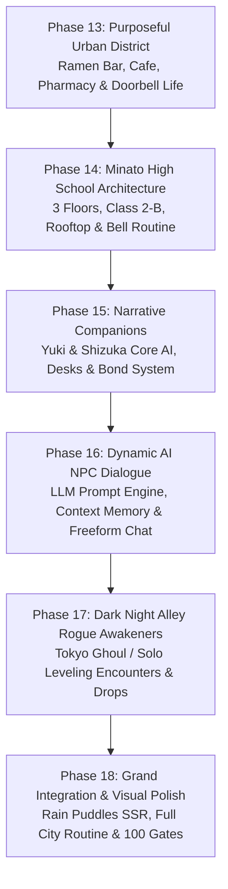

# 11.11 — STUDIO MASTER PLAN: GENSHIN × GTA × MANHWA ECOSYSTEM
**The Ultimate Fusion: Genshin Impact Audiovisual Polish & Combat + GTA Open-World Living Freedom + Solo Leveling / Tokyo Ghoul Dark Urban Mystery**

---

## 1. Executive Summary & Current Foundation

The 11.11 project has successfully established a rock-solid, AAA-verified technical bedrock across **12 completed production phases**, validated with **82/82 automated headless gates (100% OK, exit code 0)** in Godot Forward+:
- **Fluid Melee & Locomotion**: Sekiro/ZZZ parry clash, directional hit flinch, visceral stagger executions, sprint/walk gait synchronization, Mixamo dodge rolls, hard landing recovery, and Genshin-style surface swimming & wall climbing.
- **Cinematic Audiovisuals**: ACES tone mapping, forward+ volumetric fog, custom anime sky dome, Cel/NPR character shader with anisotropic hair sheen, screen shake, and 40+ procedural sound effects.
- **RPG & Traversal Systems**: 3-character quick-swap & screen-wide ultimate burst system, HUD loot feed toasts, panoramic compass radar bar, 24-hour day/night cycle, dynamic weather (rain/fog), persistent inventory, hunger/thirst/energy needs, and multi-vehicle fleet (bicycle, 50cc scooter, skateboard).

To elevate 11.11 into a global anime gaming phenomenon that merges **Genshin Impact's combat fluidness and visual grandeur** with **GTA's living open-world freedom and deep urban interactivity**, while staying strictly faithful to the psychological mystery of **Solo Leveling and Tokyo Ghoul**, this Master Plan defines the complete evolutionary roadmap.

---

## 2. Current Gap Analysis

| Dimension | Current Status (Phase 12) | Target Generation (Phase 18) |
| :--- | :--- | :--- |
| **1. City Interactivity (GTA Tier)** | 5 houses with doorbells, konbini and vending machines. | **EVERY building purposeful**: Ramen shop, cafe, school, pharmacy, arcade, clinic, and full residential interior life. |
| **2. NPC Depth & Intelligence** | Pre-authored dialogue branches based on familiarity tiers. | **Hybrid Generative AI (ChatGPT-style)** & Persona-style dynamic chat with memory, emotion, and freeform input. |
| **3. High School Ecosystem** | Mentioned in lore & notices only; no accessible campus. | **Full 3-story Minato High**: Classrooms, rooftop, gym, library, lockers, lessons, teachers & bell routines. |
| **4. Narrative Companions** | Yuki in party swap slot; Shizuka mentioned in text. | **Yuki** (tactical friend) & **Shizuka** (emotional anchor) with deep bond storylines and school life presence. |
| **5. Dark Urban Nocturnal Threat** | Boss confined to Sector 11; streets peaceful at night. | **Night Rogue Awakeners** in narrow alleys; Tokyo Ghoul / Solo Leveling dark manhwa ambush battles. |

---

## 3. The 6 Pillars of the Genshin × GTA × Manhwa Vision

### Pillar 1: Minato High School (المدرسة اليابانية المتكاملة)
A complete, authentic 3-story Japanese High School campus seamlessly integrated into the Minato-Kasumi district:
- **Floor 1 (Ground)**: Grand entrance gate, Cherry Blossom alleyway, shoe locker vestibule (Geta-bako) where outdoor shoes are swapped for indoor slippers, faculty staff room, and indoor gymnasium.
- **Floor 2 (Classrooms)**: Class 2-B (Echo, Yuki, and Shizuka's classroom), science lab with chemical glassware, student council room, and nurse's health bay (recovers HP/sanity).
- **Floor 3 & Rooftop**: Art room, library (with lore books and archives), and the iconic fenced Japanese school rooftop (sunset panorama, lunch bento spot, deep psychological dialogues).
- **Academic Daily Routine**: Morning bell (08:30 AM), homeroom, interactive lesson mini-games (History of the Cataclysm, Science of Neural Resonance, Literature), lunch break (12:30 PM), after-school club hours (15:30 PM).

### Pillar 2: Dynamic AI Dialogue Engine (التواصل والتفاعل الذكي مع الشخصيات)
- **ChatGPT-Style Responsive Dialogue**: When interacting with any NPC (students, teachers, shopkeepers, neighbors), the player can choose classical multiple-choice dialogue OR enter freeform text/voice prompts.
- **In-Game Context Awareness**: The NPC engine injects dynamic prompt context:
  - Current district time & weather (e.g. "It's raining heavily at 10 PM").
  - Player's outfit, weapon status (sheathed vs. drawn), and sanity/corruption level.
  - Familiarity tier and past conversation memory.
- **Offline / Structured Fallback**: High-speed contextual matrix ensuring instant response times even without cloud internet, seamlessly connecting to local/remote LLM endpoints via HTTP/WebSockets.

### Pillar 3: Key Narrative Companions — Yuki & Shizuka
- **Yuki Tachibana (صاحب إيكو الوفي — درع الجليد والصداقة)**:
  - Athletic, fiercely loyal, sits at the desk to Echo's left in Class 2-B.
  - Notices Echo's mysterious disappearance and returns; investigates rumors of Sector 11 with him.
  - Combat role: Cryo/Cyan Resonance Aegis; can be summoned as an active companion in street skirmishes.
- **Shizuka (صديقة إيكو المقربة — ملاك الطمأنينة والأمل)**:
  - Empathetic, observant, member of the Student Council and Library Committee; sits in front of Echo.
  - Serves as the emotional anchor preventing Echo's Zero corruption from consuming his humanity.
  - Unlocks deep bond stories, bento sharing moments, and psychological comfort sequences that restore Echo's mental stability.

### Pillar 4: Nocturnal Dark Manhwa Encounters — Rogue Awakeners (صراع الأزقة الليلية)
- **Solo Leveling & Tokyo Ghoul Dark Urban Fantasy**:
  - Between **21:00 PM and 04:00 AM**, the serene seaside town takes on an eerie, psychological horror atmosphere.
  - Streetlights flicker; reality glitch anomalies tear through the narrow labyrinthine back-alleys.
- **Rogue Awakeners (المتحولون الأحرار)**:
  - Individuals who, like Echo, underwent black-market neural resonance experiments or were infected by Zero singularity fragments.
  - Manifest monstrous shadowy appendages, red eye trails, and serrated weapons.
  - Ambush combat encounters in claustrophobic alleyways, fire escapes, and abandoned docks.
  - Defeating them yields **Dark Neural Crystals**, **Stolen Yen**, and **Classified Sector 11 Documents**.

### Pillar 5: Purposeful Urban Living Ecosystem (كل مبنى له فائدة وحياة)
Zero dead space or decorative-only facades. Every urban structure is interactive:
- **Residential Houses (5+ Families)**: Ringing any doorbell triggers animated door openings with dynamic resident personalities (kind grandma offering tea, grumpy salaryman complaining about noise, classmate inviting Echo in).
- **Kasumi Ramen Noodle Bar**: Sit on counter stools, order hot Tonkotsu Ramen or Spicy Gyoza, watch the chef prepare food, restore 100% hunger.
- **Kasumi Cafe & Bakery**: Cozy jazz music, buy drip coffee and melon pan, study with Yuki or Shizuka for mental focus buffs.
- **24/7 Pharmacy & Clinic**: Buy medical bandages, adrenaline shots, and sedative pills to manage trauma and glitch spikes.
- **Retro Arcade (Game Center)**: Playable 80s arcade cabinets, crane claw games, and social gathering spot for students.

### Pillar 6: Audiovisual & Animation Supremacy
- **Genshin / ZZZ Cel-Shaded Richness**: Deep anime color grading (warm amber sunsets, cold cyan neon, pitch obsidian shadows).
- **Mixamo Animation Library Expansion**: Full integration of running slides, wall-vaulting, seated eating gestures, umbrella-holding during rain, and expressive emotional gestures.
- **Atmospheric Spatial Audio**: Procedural environmental audio (distant train horns, cicadas during noon, rain pattering on tin roofs, neon sign humming).

---

## 4. Phased Implementation Roadmap (Phases 13 – 18)

### Phase 13: Purposeful Urban District Expansion (Ramen, Cafe, Clinic, Residential Life)
1. **Interactive Venues**:
   - `KasumiRamenBar.gd`: Counter seating, menu UI, eating animations, and steaming broth VFX.
   - `KasumiCafe.gd`: Coffee brewing, ambient jazz music stream, table seating, and social conversation points.
   - `KasumiPharmacy.gd`: Medicine purchasing (bandages, mental stabilizers, stamina tonics).
2. **Enhanced Residential Doorbells**:
   - Animated door opening mesh; randomized resident spawns with time-aware greetings and hospitality events.
3. **Headless Verification**:
   - Gates 83 & 84: Restaurant dining / meal ingestion, pharmacy medicine effects, and dynamic residential door interactions.

### Phase 14: Minato High School (Full 3-Story Campus & Schedule)
1. **School Architecture**:
   - Author `MinatoHighSchool.tscn`: Main gate, shoe locker foyer, Class 2-B, faculty room, library, nurse office, gym, and rooftop.
2. **School Schedule Engine**:
   - `SchoolScheduleController.gd`: Clock-driven bells, classroom attendance, lesson mini-games, and teacher NPC routines.
3. **Headless Verification**:
   - Gates 85 & 86: School campus navigation, locker shoe-swap, Class 2-B attendance, and rooftop access.

### Phase 15: Narrative Companions — Yuki Tachibana & Shizuka
1. **Companion Core Controllers**:
   - `YukiCompanionController.gd`: In-class desk behaviors, after-school hangout options, and tactical combat companion AI.
   - `ShizukaCompanionController.gd`: Empathetic emotional support, bento sharing, sanity healing, and confidential memory logs.
2. **Affection & Bond System (Confidant)**:
   - `CompanionBondManager.gd`: Tiers 1–10 bond progression, special team synergy perks, and unique story cutscenes.
3. **Headless Verification**:
   - Gates 87 & 88: Yuki & Shizuka classroom interactions, bond rank elevation, and tactical combat summons.

### Phase 16: Dynamic AI-Driven NPC Dialogue Engine
1. **Dialogue Orchestrator**:
   - `DynamicAIDialogueEngine.gd`: Context aggregator (time, location, player state, relationship history) generating rich prompts.
   - Freeform text input modal in `GameplayHUD.gd`.
   - Dual-mode architecture: Online LLM endpoint streaming + high-speed offline fallback neural response matrix.
2. **Headless Verification**:
   - Gates 89 & 90: Dynamic prompt generation, context serialization, response parsing, and fallback safety.

### Phase 17: Nocturnal Rogue Awakeners & Alley Skirmishes
1. **Rogue Awakener AI**:
   - `RogueAwakener.gd`: Hostile human-turned-monarch enemy with dark katana combat, shadow blink, and crimson eye trails.
   - Dynamic spawn zones in back-alleys active strictly between 21:00 and 04:00.
2. **Loot & Lore Progression**:
   - Defeating Awakeners drops Dark Neural Fragments, uncovering the conspiracy of Dr. Kinga's illicit human experiments.
3. **Headless Verification**:
   - Gates 91 & 92: Nocturnal spawn trigger, alley combat behavior, shadow blink counter, and loot feed unboxing.

### Phase 18: Grand Studio Polish, Visual Reflections & 100-Gate Milestone
1. **Visual Splendor**:
   - Real-time wet street asphalt puddles with screen-space reflections (SSR) and rain droplet ripples.
   - Cinematic anime lens flare, depth-of-field focus pulling on dialogues, and color grading presets.
2. **100-Gate Quality Baseline**:
   - Full automated test suite reaching 100 AAA World-Class Gates verified with 0 errors.

---

## 5. Architectural Quality Mandates

1. **Preserve User Dirty Work**: Never modify or overwrite `artifacts/eleven-eleven/godot/scenes/environment/sector11_facility.tscn` or `artifacts/eleven-eleven/godot/scenes/main.tscn`.
2. **Autonomous Headless Evidence**: Every single system, building, dialogue engine, and character behavior must be 100% verified via automated Godot headless tests before milestone delivery.
3. **True Manhwa Aesthetic**: Retain the dark psychological contrast of *Solo Leveling* and *Tokyo Ghoul*—underneath the vibrant anime school life lies an ominous, terrifying conspiracy.
