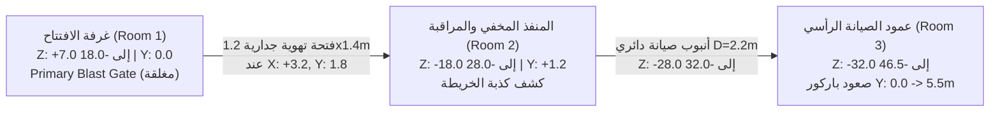

# الميثاق الهندسي لتصميم المستويات ومكافحة التكدس المعماري
## وثيقة التصميم المعماري الإلزامية: رحلة الـ 12 غرفة (Echo Network — 90–120 دقيقة)

> [!IMPORTANT]
> **الصفة:** وثيقة مرجعية صارمة ومقيدة لجميع مصممي المستويات ومهندسي المشاهد في Godot وBlender.
> **الهدف القاطع:** منع تكديس أو حشر العناصر في غرفة واحدة، وضمان انتقال جغرافي وطوبوغرافي حقيقي ومستقل عبر 12 قطاعاً بمسافات وهوية بصرية وحركية متفردة.

---

## 1. فلسفة وقانون "منع العجقة وحظر حشر الأشياء في غرفة واحدة" (Anti-Crowding Invariant)

### 1.1. تشخيص الخلل المعماري السابق (The Legacy Pitfall)
في النماذج الأولية السابقة (كما ظهر في مشهد `sector11_facility.tscn` القديم):
- جرى تجميع غرفة الكبسولة مع دهليز التطهير وغرفة المولدات وخزنة السيرفرات في مشهد متلاصق واحد (`Z = 0` إلى `Z = -80`).
- **النتيجة الكارثية:** 
  1. تداخل الإضاءة (Light Bleed): أضواء النيون والمصابيح تتسرب بين الغرف وتلغي تباين الظلال.
  2. تشويش الصوت (Acoustic Bleed): أصوات المولدات وصفارات الإنذار تُسمع من أول خطوة للاعب وتلغي عنصر المفاجأة.
  3. حشر المهام (Task Overcrowding): وضع 4 أهداف تفاعلية (ساعة، صورة، كابل طاقة، محطة شفرات، وصندوقين) في مساحة 15×15 متراً، مما حوّل اللعب إلى نقر عشوائي بدلاً من استكشاف بيئي متدرج.
  4. تلاشي إحساس الهروب (Illusion of Progress Loss): شعر اللاعب بأنه يدور داخل "صندوق مستودع واحد" مقسم بقواطع كرتونية بدلاً من الهروب عبر منشأة عملاقة متعددة الطوابق.

### 1.2. المبادئ الهندسية الأربعة لقانون مكافحة التكدس
1. **مبدأ استقلالية الغرفة (Single Beat & Mechanical Focus):**
   كل غرفة من الـ 12 تملك **فكرة لعب ميكانيكية مهيمنة واحدة** + **كشفاً سردياً رئيسياً واحداً**. لا يُسمح بإقحام لغز طاقة داخل غرفة تسلل، ولا بوضع صندوق غنائم يشتت انتباه اللاعب في غرفة مطاردة.
2. **العزل المكاني والتحميل المجزأ (Hermetic Enclosure & Scene Decoupling):**
   كل غرفة تُبنى في مشهد مستقل (`PackedScene`) مع حدود فيزيائية مغلقة تماماً (Watertight/Hermetic). الغرفة السابقة تُفرغ أو تُعطل دورة معالجتها (`set_process(false)`) بمجرد قفل بوابة العبور، مما يوفر 100% من موارد الرسوميات والصوت.
3. **جيوب العزل وممرات الموازنة (Decompression Buffers & S-Curved Linkages):**
   يُحظر منعاً باتاً وجود جدار مشترك بين غرفتين رئيسيتين (Zero Shared Walls Invariant). يجب دائماً وضع ممر وسيط عازل (Buffer Zone) بطول لا يقل عن 6 إلى 12 متراً، يلتف بزاوية أو يحتوي على بوابتي ضغط متتابعتين لمنع الرؤية المباشرة وتداخل الصوت والإضاءة.
4. **التدرج الطوبوغرافي الرأسي والأفقي (3D Topographical Diversity):**
   توزيع الغرف على مستويات ارتفاع متغيرة (`Y-Axis Altitude Shifts`) تبدأ من السطح (`Y = 0`) وترتفع عبر عمود الصيانة (`Y = +5.5m` إلى `+10.8m`) ثم تهبط إلى أقبية المفاعل (`Y = -4.0m` إلى `-15.0m`) قبل أن تصعد مجدداً إلى المختبر العلوي (`Y = +18.0m`).

---

## 2. المسح الشامل للقطاعات الـ 12 المستقلة (90–120 دقيقة)

| # | اسم القطاع / الغرفة | الأبعاد المعمارية (العرض × الطول × الارتفاع) | الارتفاع الرأسي (Y) | زمن اللعب المستهدف | الفكرة الميكانيكية السائدة | الهوية البصرية ومواد الإكساء | لغة الإضاءة والجو المحيط | نمط الممر الانتقالي القادم |
|---|---|---|---|---|---|---|---|---|
| **1** | **غرفة النظام الافتتاحية**<br>(Awakening Cryo-Chamber) | 18.0m × 25.4m × 7.2m | `Y = 0.0m` | 8 دقائق | الاستيقاظ، تتبع الأثر، فك شفرة محطة الإشارة | أرضية مغمورة بالماء العاكس (`flooded_lab_floor`)، خرسانة باردة، دعامات صلب هيدروليكية | إضاءة كئيبة خافتة، خطوط نيون سماوية (`Cyan #00E0FF`)، ومضات طوارئ بنفسجية | فتحة تهوية جدارية ضيقة مرتفعة (Vent Duct) |
| **2** | **مراقبة الخروج والمنفذ المخفي**<br>(Surveillance Vestibule) | 10.0m × 14.0m × 4.2m | `Y = +1.2m` | 5 دقائق | فحص خريطة المخرج الكاذبة، كشف كذبة النظام، فتح فتحة الصيانة | ألواح سيراميك معزولة، كابلات معلقة، شاشات مراقبة متصدعة | ضوء شاشات باهت، كشاف أصفر خافت يركز على الخريطة الكاذبة | أنبوب صيانة أسطواني بقطر 2.2m |
| **3** | **عمود الصيانة الرأسي**<br>(Vertical Maintenance Shaft) | 9.8m × 15.0m × 11.0m | `Y = 0.0m` إلى `+10.8m` | 15 دقيقة | باركور رأسي متعدد الطبقات، قفز فجوات، تدوير عجلة تفريغ الضغط | جرافيت مصقول ومعدن صناعي صدئ، شبكات تهوية، سلالم طوارئ | إضاءة بخار بيضاء نافذة، كشافات صناعية باردة، ظلال عمودية حادة | ممر موازنة ضغط هيدروليكي مزدوج البوابات |
| **4** | **الحاجز الأمني وغرف الفحص**<br>(Security Checkpoint) | 8.8m × 18.4m × 4.8m | `Y = +5.4m` | 12 دقيقة | تسلل بشري، مراوغة كشاف الرادار، تشتيت الإشارة، فتح قفل الممر | بلاط أرضي هندسي، حواجز تستر كربونية، ألياف زجاجية معتمة | كشاف رادار مخروطي متأرجح بلون برتقالي كهرماني يتحول إلى أزرق هادئ عند التعطيل | منحدر هابط إلى مجرى خدمات سفلي |
| **5** | **جناح العينات والمواضيع**<br>(Subjects / Specimen Ward) | 22.0m × 30.0m × 6.0m | `Y = -4.0m` (سرداب) | 10 دقائق | رعب نفسي، مراوغة الكيانات غير المستقرة، استخدام الإلهاء البيئي | كبسولات زجاجية بيولوجية أسطوانية، أرضية معقمة ملوثة، عوازل كيميائية | إضاءة بيولوجية ذاتية خضراء داكنة (`#144D32`)، ظلال الكبسولات الطافية | نفق كابلات مقوس ضيق (Arched Cable Trench) |
| **6** | **الأرشيف واسترجاع الذاكرة**<br>(Memory Archives Vault) | 20.0m × 26.0m × 8.5m | `Y = -4.0m` إلى `-1.0m` | 12 دقيقة | فك تشفير أقراص الذاكرة، استعراض ومضات الماضي (يوكي/شيزوكا) | أبراج سيرفرات شاهقة، أرفف بيانات فولاذية، زجاج أرشيفي مضاد للرصاص | تدرج ألوان سينمائي ناعم دافئ ذهبي/عاجي داخل منصة الاسترجاع متباين مع صقيع الأرشيف | جسر مشاة معلق يطل على المفاعل |
| **7** | **محطة الطاقة والجسور الهيدروليكية**<br>(Central Power Substation) | 36.0m × 44.0m × 16.0m | `Y = -15.0m` إلى `0.0m` | 15 دقيقة | إعادة توجيه مسارات التغذية، تحريك الجسور الهيدروليكية لفتح مسارات القفز | مولدات عملاقة، مكثفات كهربائية، شبكات مشاة معدنية مثقبة (Grating) | تفريغات كهربائية زرقاء نيون، إضاءة تحذيرية برتقالية متناوبة، ظلال شبكية متحركة | أنبوب عادم طوارئ رأسي مزود بمقابض تسلق |
| **8** | **منطقة الاحتواء والمطاردة الرأسية**<br>(Containment Breach Ascent) | 14.0m × 14.0m × 24.0m | `Y = 0.0m` إلى `+18.0m` | 10 دقائق | هروب رأسي سريع واختبار مهارات الباركور تحت ضغط انهيار المنشأة | جدران أمان مصفحة ممزقة، أنابيب متفجرة، منصات تسقط بعد ثوانٍ | ومضات إنذار حمراء إيقاعية (`Strobe Alert`)، ألسنة لهب بخارية كاشفة للمسار | فتحة نجاة هوائية تقود إلى غرفة راحة معزولة |
| **9** | **غرفة المرآة والراحة النفسية**<br>(The Mirror Chamber) | 8.0m × 8.0m × 3.6m | `Y = +18.0m` | 8 دقائق | صمت واستكشاف بطيء، فحص المرآة، ملاحظة انعكاس إيكو المتأخر | أرضية خشبية رمادية ميتة، جدران عازلة للصوت ناعمة، مرآة زجاجية ضخمة | ضوء أبيض محايد ناعم غير موجه (Ambient Diffused)، هدوء بصري تام بلا نيون | بوابة معدنية بيضاء تفضي إلى ممر الفحص الطبي |
| **10** | **مختبر دكتور كينجا**<br>(Dr. Kinga's Surgical Theater) | 24.0m × 28.0m × 9.0m | `Y = +18.0m` | 15 دقيقة | تقييد، حوار درامي ياباني، محاولات مقاومة فيزيائية، مشهد الغرق | مسرح جراحي دائري، أذرع روبوتية، شاشات قياس عصبية، بركة سائل تجارب مظلمة | إضاءة كشافات جراحية باردة ومسلطة بدقة على طاولة الفحص، محيط معتم كلياً | تمزق الواقع والانتقال الفضائي (Dimensional Rift) |
| **10b** | **المحيط الأسود وفضاء عقد زيرو**<br>(The Abyssal Void) | غير محددة (Infinite Sim) | فضاء عائم | 8 دقائق | السير في الفراغ، محاورة كيان Zero، اتخاذ قرار توقيع العقد | مادة سائلة داكنة غير عاكسة، جزيئات رماد متطايرة، تموجات كهرومغناطيسية | سماء مظلمة، وهج بنفسجي وأحمر عميق ينبعث من عين وأجنحة Zero | انفجار ضوئي عاصف يعيد تشكيل العالم الفيزيائي |
| **11** | **ساحة التحرر والانتقام**<br>(Liberation & Reality Break) | 32.0m × 32.0m × 12.0m | `Y = +18.0m` | 10 دقائق | تفعيل قدرة الظل الأولى، قتال حراس كينجا، تجميد الواقع وطلب الأمنية | مختبر كينجا وقد تحطمت جدرانه وتناثرت شظاياه معلقة في الهواء بفعل الـ Glitch | إضاءة بنفسجية كهرومغناطيسية مكثفة، تأثيرات تكسر الفضاء (Glitch Shaders) | وميض بياض تام يلاشي العالم (Fade to Pure White) |
| **12** | **غرفة المستشفى — العالم الحقيقي**<br>(Decompression Ward / Hospital) | 6.4m × 5.8m × 3.2m | `Y = 0.0m` (نظام إحداثيات أرضي جديد) | 5 دقائق | الاستيقاظ على السرير، فحص الجسد والمرآة، اكتشاف وشم `EX-011` على الرقبة | طلاء جدران مدني مطفي، أرضية فينيل طبية، أثاث مستشفى واقعي إنساني | ضوء قمر أزرق بارد نافذ من نافذة المطر ليمتزج مع إضاءة شاشة تخطيط القلب الخضراء | نهاية الفصل الأول وبداية العالم الحقيقي |

---

## 3. تدقيق الربط الهندسي المليمتري (Millimeter Architectural Linkage Audit)

### 3.1. الربط الهندسي: من غرفة الافتتاح (1) إلى عمود الصيانة (3) عبر المنفذ المخفي (2)


#### القياسات الدقيقة والمواصفات:
1. **نهاية غرفة الافتتاح (`Sector11VisualShell`):**
   - الجدار الشمالي النهائي عند `Z = -18.0m`.
   - البوابة الهيدروليكية `PrimaryBlastGate` عرضها 7.2m بين `X = -3.6` و `X = +3.6`.
   - **القرار المعماري الإلزامي:** البوابة الهيدروليكية مغلقة ومحكمة الضغط؛ محاولة فتحها تفشل وتكشف رسالة النظام المضللة.
2. **المنفذ الانتقالي (Vent Duct #1):**
   - الموقع: الجدار الشمالي الشرقي عند `X = +3.2m`, `Y = 1.8m`, `Z = -18.0m`.
   - الأبعاد: عرض 1.2m، ارتفاع 1.4m، طول النفق 4.0m (من `Z = -18.0` إلى `Z = -22.0`).
   - يتطلب زحفاً بشرياً (Crawl) أو قفزاً للتشبث بالحافة (Ledge Grab).
3. **غرفة المراقبة والمنفذ المخفي (Room 2):**
   - مركز الغرفة: `X = +3.2m`, `Y = +1.2m`, `Z = -25.0m`.
   - الأبعاد: 10m طول × 8m عرض × 4.2m ارتفاع.
   - تحتوي على لوحة شاشات المراقبة التي تعرض خريطة المنشأة المزيفة، حيث يكتشف إيكو فتحة الصيانة السفلية المتصلة بالمولدات.
4. **أنبوب الصيانة الموصل للعمود (Maintenance Conduit #2):**
   - مقطع أسطواني بقطر `2.2m` يمتد من `Z = -28.0m` إلى `Z = -32.0m`.
   - انحدار طفيف بزاوية 8 درجات نحو الأسفل يضع اللاعب عند مدخل عمود الصيانة الرأسي عند `Z = -32.0m`, `Y = 0.0m`.

---

### 3.2. الربط الهندسي: من عمود الصيانة (3) إلى الحاجز الأمني (4) عبر غرفة موازنة الضغط
```mermaid
flowchart TD
    R3["عمود الصيانة (Room 3)<br>منصة الخروج العلوية<br>COLL_ExitDeck عند Y: +5.2m, Z: -44.3m"] -->|تفاعل: عجلة تفريغ الضغط<br>ServiceOverride عند X: 1.25, Y: 5.4| GATE["بوابة الخدمة المرتفعة<br>ServiceGate بارتفاع 2.1m"]
    GATE -->|ممر موازنة ضغط عازل 6m<br>Z: -44.5 إلى -50.5 | Y: +5.4| AIRLOCK["Airlock Decompression Buffer<br>بوابتان متتابعتان تمنعان تسرب الصوت والضوء"]
    AIRLOCK -->|فتحة دخول الحاجز 1.8x2.8m| R4["الحاجز الأمني وغرف الفحص (Room 4)<br>SECURITY_ORIGIN: Vector3(0, 5.4, -50.5)<br>مسار تسلل بطول 18.4m"]
```

#### القياسات الدقيقة والمواصفات:
1. **قمة عمود الصيانة (`maintenance_vertical.tscn`):**
   - في الكود الحالي: المنصة العلوية `COLL_ExitDeck` تقع عند `Y = 5.2m`، وعجلة التفريغ عند `X = 1.25m, Y = 5.4m, Z = -12.3m` محلياً.
   - عند إزاحة المشهد الكلية في العالم الافتراضي، تصل المنصة إلى `Y = +5.4m`.
   - بوابة الخدمة `ServiceGate` تغلق فتحة بعرض `1.8m` وارتفاع `2.1m`.
2. **غرفة موازنة الضغط الإلزامية (Decompression Airlock Buffer):**
   - **الخلل الذي تم تصحيحه:** في الكود القديم، كانت بوابة الصيانة تفتح مباشرة على كشاف الرادار الأمني عند `SECURITY_ORIGIN = Vector3(0, 5.4, -32.0)` بدون أي مسافة تنفس، مما يصدم اللاعب بصوت الإنذار فور فتح البوابة!
   - **المواصفات المصححة:**
     * ممر بطول 6.0m وعرض 2.4m وارتفاع 3.0m يقع بين بوابة الصيانة وبوابة التفتيش.
     * يحتوي على صفارة تنفيس هواء مضغوط وبخار خافت.
     * الباب الثاني لا يفتح إلا بعد إغلاق باب الصيانة خلف اللاعب بـ 1.5 ثانية (Double Interlock Logic)، مما يعزل ضوضاء عمود الصيانة عزلاً صوتياً بنسبة 100%.
3. **الحاجز الأمني (`security_checkpoint_room.gd`):**
   - يبدأ عند الإحداثيات العالمية: `Vector3(0, 5.4, -50.5)`.
   - أبعاد الغرفة: عرض 8.8m، طول 18.4m، ارتفاع 4.8m.
   - ممر المشاة العلوي (`ServiceWalkway`): عند `X = 3.6m`, `Y = 7.68m` (محلي `2.28m + 5.4m`).
   - بوابة المخرج الأمني (`SecurityGate`): عند نهاية القاعة محلي `Z = -16.5m` (عالمي `Z = -67.0m`) بعرض 1.76m وارتفاع 2.8m.

---

### 3.3. مسار الربط الهندسي للأجنحة اللاحقة (الأجنحة 5 إلى 12): تجنب المحور الخطي الواحد
إذا استمرت الغرف على خط مستقيم باتجاه `-Z` فقط، ستمتد المنشأة إلى `-350m` في الفضاء، مما يسبب:
- تلاشي الإحساس بالعمق المعماري للمجمع الطبي السري.
- مشاكل Float Precision في محرك الفيزياء عند المسافات البعيدة.
- صعوبة التمييز البصري بين أجنحة المنشأة.

#### المخطط الطوبولوجي المقترح (Dog-Leg S-Curve Layout):
```
[الغرفة 1: الافتتاح] (Z: 0 -> -18)
         │  (فتحة تهوية شمالية)
[الغرفة 2: المراقبة] (Z: -18 -> -28)
         │  (أنبوب صيانة)
[الغرفة 3: عمود الصيانة الرأسي] (Z: -28 -> -43 | صعود رأسي إلى Y=+5.4m)
         │  (Airlock موازنة ضغط)
[الغرفة 4: الحاجز الأمني] (Z: -43 -> -62 | Y=+5.4m)
         └──> [انعطاف غربي -X] عبر قناة صرف مياه بيولوجية هابطة (-Y)
                   │
         [الغرفة 5: جناح العينات] (X: -20 -> -50 | Y: -4.0m)
                   │  (نفق الكابلات المقوس)
         [الغرفة 6: أرشيف الذاكرة] (X: -50 -> -76 | Y: -4.0m -> -1.0m)
                   └──> [انعطاف شمالي شرقي] عبر جسور المفاعل المعلقة
                             │
                   [الغرفة 7: محطة الطاقة] (X: -40 -> 0 | Z: -80 -> -124 | Y: -15.0m -> 0.0m)
                             │  (أنبوب العادم الرأسي الصاعد)
                   [الغرفة 8: الاحتواء والمطاردة] (Z: -124 -> -138 | صعود رأسي إلى Y=+18.0m)
                             │  (فتحة نجاة معزولة)
                   [الغرفة 9: غرفة المرآة] (X: 0 -> +8 | Z: -138 -> -146 | Y=+18.0m)
                             │  (ممر الفحص الطبي المصفح)
                   [الغرفة 10: مختبر كينجا] (X: -12 -> +12 | Z: -146 -> -174 | Y=+18.0m)
                             │  (انتقال عبر الـ Rift / المحيط الأسود 10b)
                   [الغرفة 11: ساحة التحرر والانتقام] (فضاء المختبر المحطم عند Y=+18.0m)
                             │  (كسر الواقع: انتقال سينمائي 3D)
                   [الغرفة 12: المستشفى] (نظام إحداثيات محلي مستقل يبدأ من نقطة الصفر Vector3(0,0,0))
```

---

## 4. المعايير المعمارية الصارمة السبعة لقبول أي غرفة جديدة (Architectural Acceptance Gate)

لا يُعتمد أي مشهد غرفة جديد (`.tscn` أو `.blend`) ولا يُدمج في مسار اللعبة الرئيسي إلا باجتياز الفحوصات السبعة التالية بنسبة 100%:

### 1. معيار العزل الحجمي التام (Hermetic Spatial Boundary Invariant)
- **الشرط:** لكل غرفة صندوق تصادم خارجي محكم (Watertight Hull) يمنع خروج اللاعب أو سقوط الكاميرا في الفراغ الرمادي تحت أي ظرف من ظروف الحركة السريعة (Sprint / Wall-kick).
- **الفحص:** تشغيل اختبار القفز الأعمى في جميع الزوايا الأربع مع التحقق من عدم وجود أي ثغرة تصادم (Collision Gap) تتجاوز `0.05m`.
- **منع تسرب الضوء:** جميع الجدران الخارجية تحمل سماكة فيزيائية لا تقل عن `0.4m` مع تفعيل `cast_shadow = ON` لمنع تسرب ظلال ومصابيح الغرف المجاورة (Zero Light Bleed).

### 2. ميزانية المقياس الإنساني وحركة الباركور (Human-Scale & Traversal Metrics)
مستندة إلى قياسات جسد إيكو الرسمية (الارتفاع: 1.72m، عرض الكتفين: 0.52m، نطاق التشبث باليد: 2.10m):
- **ارتفاع الأسقف:** 
  * ممرات الزحف والتهوية: لا تقل عن `1.4m` ولا تزيد عن `1.8m`.
  * ممرات المشي العادية: لا تقل عن `3.2m`.
  * قاعات الباركور الرأسي: لا تقل عن `7.2m` لتأمين زوايا الكاميرا حرة الدوران دون الاصطدام بالسقف.
- **عرض الممرات والجسور:**
  * ممرات المشي الآمنة: لا تقل عن `2.2m`.
  * عوارض التوازن الحافية (Ledge / Catwalk): لا تقل عن `0.45m`.
- **أسطح التسلق (Climbable Surfaces):**
  * يجب وسمها صراحة ضمن مجموعة `climbable`.
  * مسافة المقابض الرأسية بين الدرجة والأخرى: بين `0.30m` و `0.35m`.
  * الحافة القابلة للتشبث (Mantle Ledge) يجب أن توفر مساحة خلو رأسية لا تقل عن `1.8m` فوقها ومساحة وقوف أفقية لا تقل عن `0.8m × 0.8m`.

### 3. ميزانية الكثافة المكانية ومكافحة الحشو (Entity & Puzzle Density Budget)
- **قاعدة العنصر التفاعلي الواحد:** لا يُسمح بأكثر من **عنصر تفاعلي رئيسي واحد** (Terminal, Valve, Keycard Reader) في دائرة نصف قطرها `5.0m`.
- **الفصل بين الاستكشاف والخطر:** يُحظر وضع لغز يتطلب تركيزاً ذهنياً (فك شفرة أو مطابقة ترددات) داخل منطقة تغطية كاميرا مراقبة نشطة أو دورية عدو مباشرة؛ يجب دائماً توفير جيب آمن (Safe Haven) يبعد `3.0m` على الأقل عن مسار التهديد.
- **حد الصناديق والمقتنيات:** غرفة واحدة = كشف سردي/وثيقة واحدة + صندوق غنائم أو أداة واحدة بحد أقصى. يُمنع تحويل المنشأة إلى لعبة تجميع عشوائية.

### 4. الهوية البصرية وخامات التظليل الناعم (Visual DNA & Material Invariant)
- **لغة الخامات المعتمدة:** 
  * استخدام خامات PBR مرسومة بنعومة (Stylized/Anime Soft Shading) مع خشونة منضبطة (`roughness: 0.25 - 0.70`).
  * منع الخامات الواقعية المفرطة في التفاصيل المجهرية (Micro-noise Photorealism) التي تشوه المظهر الكرتوني الأنمي.
- **هيكل الإضاءة ثلاثي الطبقات (Three-Tier Lighting Hierarchy):**
  1. *طبقة التوجيه والملاحة (Navigational Key):* إضاءة موجهة ترسم الهدف الرئيسي (الباب، المقبض، فتحة التهوية).
  2. *طبقة الهوية اللونية (Mood Fill):* ألوان النيون المحددة للمنطقة (سماوي للافتتاح، أزرق للمستشفى، كهرماني للأمن، بنفسجي للظل).
  3. *طبقة القراءة الحركية (Character Rim):* كشاف خفيف يبرز حواف جسد إيكو لمنع ضياعه في البيئات المظلمة.

### 5. العزل السمعي والبيئي (Acoustic Isolation & Ambience Zones)
- كل غرفة مستقلة صوتياً عبر مشغل بيئة صوتية (`AudioStreamPlayer3D` أو `AudioListener3D Reverb Zone`).
- ممرات العبور (Airlocks / Vents) تحتوي على مخمد صوتي يقلل حجم المؤثرات الصوتية للغرفة السابقة بمقدار `-40dB` فور إغلاق البوابة.
- لا يجوز لأي نغمة موسيقية تخص مشهداً درامياً أن تتداخل مع الحوار الصوتي الياباني؛ تُخفض الموسيقى تلقائياً بمقدار `-8dB` عند بدء التحدث (Ducking System).

### 6. بوابات الانتقال الهندسية ونقاط الحفظ الآمن (Transition Apertures & Checkpoints)
- يُمنع استخدام "النقل الفوري الأعمى" (Teleportation) بين الغرف المتجاورة؛ الانتقال يجب أن يكون فيزيائياً مرئياً للاعب عبر المشي أو التسلق أو الزحف.
- كل ممر انتقالي يحتوي على **نقطة حفظ آمنة معتمدة (Safe Anchor)** تسجل فور تجاوز اللاعب لخط منتصف الممر.
- في حال سقوط اللاعب أو موته، تتم إعادة المحاولة (Retry) في نقطة الاستراحة السابقة لنفس الغرفة في مدة لا تتجاوز ثانيتين، دون إعادة تحميل المشهد بالكامل.

### 7. ميزانية الأداء واختبار الهاتف المحمول (Hardware Performance Budget)
مبنية على تشغيل اللعبة بدقة 720p/30fps على جهاز الفحص المعتمد (Infinix Hot 40 Pro) و 1080p/60fps على الحاسوب:
- **Draw Calls:** لا تتجاوز `85 Draw Call` لكل لقطة كاميرا في الغرفة.
- **عدد المثلثات (Polygon Count):** هندسة الغرفة كاملة لا تتجاوز `60,000 مثلث` للبيئة + `35,000 مثلث` للشخصيات.
- **استهلاك خامات الفيديو (VRAM Budget):** لا يتجاوز `350MB` للمشهد النشط، مع تقليص خامات البيئة إلى 1024×1024 و 512×512 في نسخة الهاتف المحمول.
- **المصابيح الفعالة الملقية للظلال (Shadow-Casting Lights):** مصباح واحد فقط في نفس الوقت (Directional أو SpotLight واحد للرادار)، وباقي المصابيح `shadow_enabled = false`.

---

## 5. مصفوفة التحقق والاعتماد (Quality Gate Sign-off)

| المرحلة | المعيار الهندسي المفحوص | طريقة التدقيق الآلي / اليدوي | حالة الاعتماد |
|---|---|---|---|
| **Gate-A** | خلو المشهد من تداخل الإضاءة والتصادم | فحص تقاطع الـ AABBs لجميع الغرف المتجاورة في Godot Inspector | **إلزامي قبل أي إخراج فني** |
| **Gate-B** | مطابقة مقاييس الباركور وسلاسة التشبث | تشغيل سكريبت حركة اللاعب الآلي والتقاط الحواف دون أي اهتزاز للـ IK | **إلزامي قبل تصميم الألغاز** |
| **Gate-C** | مراجعة كثافة المهام وخلو الغرفة من العجقة | التأكد من وجود هدف سردي واحد وميكانيك سائد واحد لكل قطاع | **إلزامي قبل تسجيل الحوار** |
| **Gate-D** | استقرار معدل الإطارات 30fps على الهاتف | اختبار جلسة لعب متصلة 20 دقيقة على الهاتف ومراقبة استقرار الذاكرة | **شرط الموافقة النهائية للغرفة** |
